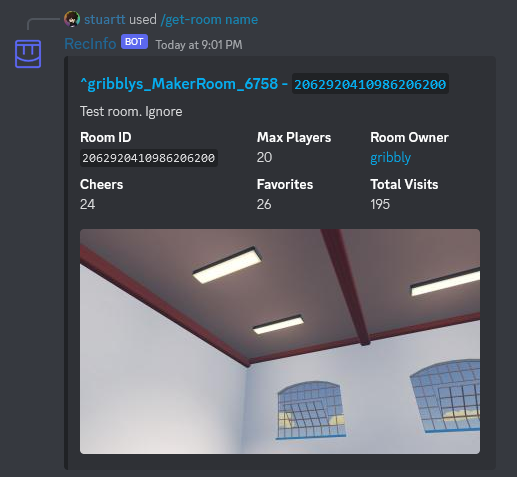

# RecInfo

A discord bot written in discord.js to interface with RecNet.

[Invite the bot!](https://discord.com/api/oauth2/authorize?client_id=519559308980256771&permissions=18432&scope=bot)

## Features

- Get user info

- Get room info [work in progress]

- More coming soon!

## Screenshots




## Building

Make sure you have [node.js](https://nodejs.org/en/) installed.

1. Fork the bot

```
git clone https://github.com/RealMCoded/RecInfo
cd RecInfo
```

2. Download dependencies

```
npm i
```

3. Clone and edit the config file

```
cp config.json.template config.json
$EDITOR config.json
```

4. Deploy the commands and start the bot

```
node deploy
node index
```